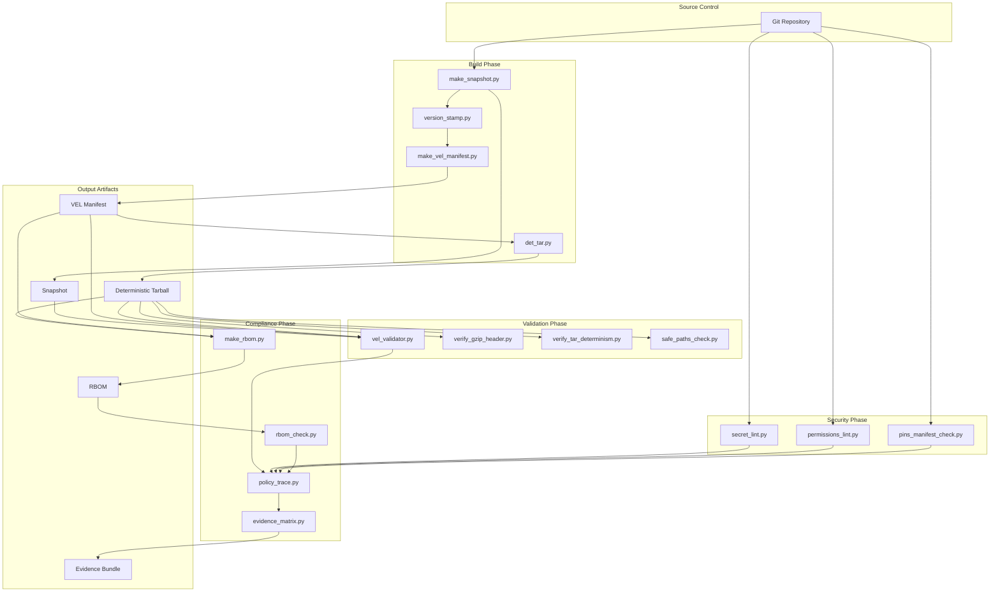

# Repro Pack Architecture Documentation

## System Overview

Repro Pack is a deterministic build and compliance system designed to create bit-for-bit reproducible software releases with complete audit trails and SLSA attestation.

---

## Architecture Diagram



---

## Component Architecture

### 1. Build Pipeline Components

#### make_snapshot.py
**Purpose**: Captures the exact state of the source tree

**Input**: Source directory path  
**Output**: Snapshot metadata (files, sizes, hashes)

**Key Features**:
- Recursively scans source tree
- Computes SHA-256 for each file
- Captures file metadata (size, mode)
- Ignores .git and build artifacts
- Outputs canonical JSON

**Data Flow**:
```
Source Tree → File Scanner → Hash Computer → JSON Serializer → snapshot.json
```

#### make_vel_manifest.py
**Purpose**: Creates Verifiable Evidence Ledger (VEL) manifest

**Input**: 
- Git repository information
- Build environment details
- Snapshot data
- Artifact hashes

**Output**: VEL manifest (vel_manifest.json)

**Structure**:
```json
{
  "provenance": {
    "git_sha": "...",
    "artifact_sha256": "...",
    "build_timestamp": "..."
  },
  "environment": {
    "python_version": "...",
    "os": "...",
    "platform": "..."
  },
  "results_contract": {
    "snapshot_sha256": "...",
    "file_count": 0,
    "total_size": 0
  }
}
```

#### det_tar.py
**Purpose**: Creates deterministic tarball

**Key Techniques**:
- Files sorted alphabetically
- UID/GID set to 0
- mtime set to 0 (epoch)
- No user/group names
- Consistent compression

**Determinism Guarantees**:
```
Same Source + Same Tool = Bit-for-Bit Identical Output
```

---

### 2. Validation Pipeline Components

#### vel_validator.py
**Purpose**: Validates VEL manifest against artifacts

**Validation Steps**:
1. Schema validation (required fields present)
2. JSON Schema validation (if schema provided)
3. Artifact hash verification
4. Git commit verification (optional)

**Exit Codes**:
- 0: Success
- 2: Validation failed

#### verify_tar_determinism.py
**Purpose**: Ensures tarball metadata is deterministic

**Checks**:
- ✅ File ordering (alphabetical)
- ✅ UID = 0
- ✅ GID = 0
- ✅ mtime = 0
- ✅ uname = ""
- ✅ gname = ""

#### verify_gzip_header.py
**Purpose**: Validates gzip header for reproducibility

**Checks**:
- Magic bytes (1f 8b)
- OS byte = 3 (Unix)
- mtime = 0
- Extra flags

---

### 3. Security Pipeline Components

#### secret_lint.py
**Purpose**: Detects secrets and credentials in source code

**Detection Methods**:
1. **Pattern Matching**: Regex for known secret formats
2. **Entropy Analysis**: High-entropy strings (likely secrets)
3. **Context Analysis**: Variable names suggesting secrets

**Detected Patterns**:
- API keys (aws, github, stripe, etc.)
- Private keys (RSA, EC, SSH)
- Passwords and tokens
- Connection strings
- JWT tokens

**Output**: List of findings with line numbers and severity

#### permissions_lint.py
**Purpose**: Validates file permissions for security

**Rules**:
- Private keys: Must be 0600 (owner read/write only)
- Scripts: Must have execute bit
- Config files: Should not be world-writable
- Sensitive files: Should not be world-readable

#### pins_manifest_check.py
**Purpose**: Validates GitHub Actions pins

**Checks**:
- All actions pinned to SHA (not tag/branch)
- SHA format validation (40 hex chars)
- No floating tags (v1, main, latest)

**Why Pin Actions?**:
- Security: Prevent supply chain attacks
- Reproducibility: Ensure consistent behavior
- Auditability: Know exact code version

---

### 4. Compliance Pipeline Components

#### make_rbom.py
**Purpose**: Generates Release Bill of Materials

**RBOM Structure**:
```json
{
  "schema_version": "1.0",
  "release_version": "v1.0.0",
  "generated_at": "2025-10-14T00:00:00Z",
  "artifacts": [
    {
      "name": "artifact.tar.gz",
      "sha256": "...",
      "size": 12345,
      "type": "archive"
    }
  ],
  "metadata": {
    "build_id": "...",
    "git_sha": "..."
  }
}
```

#### rbom_check.py
**Purpose**: Validates RBOM against policy

**Policy Checks**:
- Schema version compatibility
- Required artifacts present
- Forbidden file patterns
- Size limits
- Artifact count limits

#### policy_trace.py
**Purpose**: Traces policy enforcement through build

**Tracks**:
- Which policies were checked
- When they were checked
- Results of each check
- Policy versions used

#### evidence_matrix.py
**Purpose**: Generates evidence matrix for auditors

**Matrix Contents**:
```
Evidence Type       | Tool              | Status | Output
--------------------|-------------------|--------|------------------
Snapshot            | make_snapshot     | ✅ Pass | snapshot.json
VEL Manifest        | make_vel_manifest | ✅ Pass | vel_manifest.json
Deterministic Tar   | det_tar           | ✅ Pass | artifact.tar.gz
Tar Validation      | verify_tar_det    | ✅ Pass | tar_check.json
Secret Scan         | secret_lint       | ✅ Pass | no_secrets.json
Permission Check    | permissions_lint  | ✅ Pass | perms_ok.json
RBOM                | make_rbom         | ✅ Pass | release_bom.json
RBOM Validation     | rbom_check        | ✅ Pass | rbom_check.json
```

---

## Data Flow Architecture

### End-to-End Build Flow

```
┌─────────────────────────────────────────────────────────────┐
│ 1. SOURCE CAPTURE                                           │
│                                                              │
│  Git Repo → make_snapshot → snapshot.json                  │
│           → version_stamp → VERSION                         │
└─────────────────┬───────────────────────────────────────────┘
                  │
┌─────────────────▼───────────────────────────────────────────┐
│ 2. MANIFEST GENERATION                                       │
│                                                              │
│  snapshot.json + git info → make_vel_manifest →             │
│                             vel_manifest.json                │
└─────────────────┬───────────────────────────────────────────┘
                  │
┌─────────────────▼───────────────────────────────────────────┐
│ 3. ARTIFACT CREATION                                         │
│                                                              │
│  Source Files → det_tar → artifact.tar                      │
│              → gzip(mtime=0) → artifact.tar.gz              │
└─────────────────┬───────────────────────────────────────────┘
                  │
┌─────────────────▼───────────────────────────────────────────┐
│ 4. VALIDATION                                                │
│                                                              │
│  ├─ vel_validator(artifact.tar.gz, vel_manifest.json)       │
│  ├─ verify_gzip_header(artifact.tar.gz)                     │
│  ├─ verify_tar_determinism(artifact.tar.gz)                 │
│  └─ safe_paths_check(artifact.tar.gz)                       │
└─────────────────┬───────────────────────────────────────────┘
                  │
┌─────────────────▼───────────────────────────────────────────┐
│ 5. SECURITY CHECKS                                           │
│                                                              │
│  ├─ secret_lint(source_tree)                                │
│  ├─ permissions_lint(source_tree)                           │
│  └─ pins_manifest_check(.github/workflows/)                 │
└─────────────────┬───────────────────────────────────────────┘
                  │
┌─────────────────▼───────────────────────────────────────────┐
│ 6. COMPLIANCE                                                │
│                                                              │
│  ├─ make_rbom(artifacts/) → release_bom.json                │
│  ├─ rbom_check(release_bom.json, policy.json)               │
│  ├─ policy_trace(all_checks) → policy_trace.json            │
│  └─ evidence_matrix(all_outputs) → evidence.json            │
└─────────────────┬───────────────────────────────────────────┘
                  │
┌─────────────────▼───────────────────────────────────────────┐
│ 7. OUTPUTS                                                   │
│                                                              │
│  ├─ artifact.tar.gz (reproducible binary)                   │
│  ├─ vel_manifest.json (provenance)                          │
│  ├─ release_bom.json (BOM)                                  │
│  ├─ evidence.json (audit trail)                             │
│  └─ slsa_attestation.json (SLSA provenance)                 │
└──────────────────────────────────────────────────────────────┘
```

---

## Security Architecture

### Defense in Depth

**Layer 1: Input Validation**
- Source tree scanning for secrets
- Path traversal prevention
- Permission checking

**Layer 2: Build Isolation**
- Deterministic environment
- No network access during build
- Reproducible dependencies

**Layer 3: Output Validation**
- Artifact hash verification
- Manifest validation
- RBOM policy enforcement

**Layer 4: Evidence Generation**
- Complete audit trail
- Cryptographic signatures
- Immutable evidence

### Threat Model

| Threat | Mitigation |
|--------|-----------|
| **Supply Chain Attack** | Pin all dependencies, verify hashes |
| **Credential Leak** | Secret scanning before commit |
| **Tampered Artifacts** | SHA-256 verification, SLSA attestation |
| **Malicious Dependencies** | RBOM validation, policy enforcement |
| **Path Traversal** | Safe path checking in archives |
| **Timestamp Manipulation** | Force mtime=0 everywhere |

---

## Reproducibility Architecture

### Principles of Reproducible Builds

1. **Deterministic Inputs**
   - Fixed tool versions
   - Pinned dependencies
   - Normalized environment

2. **Normalized Outputs**
   - Sorted file ordering
   - Zeroed timestamps
   - Consistent permissions

3. **Isolated Environment**
   - No network during build
   - Clean build directory
   - Documented dependencies

4. **Verifiable Process**
   - Complete provenance
   - Audit trail
   - Independent verification

### Reproducibility Guarantees

```
Given:
  - Same source code (Git SHA)
  - Same tool versions
  - Same build commands

Then:
  - Artifacts are bit-for-bit identical
  - SHA-256 hashes match
  - Independent builders get same result
```

---

## Integration Points

### CI/CD Integration

**GitHub Actions Example**:
```yaml
- name: Build
  run: make build

- name: Validate
  run: make verify

- name: Create RBOM
  run: make rbom

- name: Check Compliance
  run: make compliance
```

**GitLab CI Example**:
```yaml
build:
  script:
    - bash init.sh
    - make build
    - make verify
    - make tar

compliance:
  script:
    - make rbom-check
    - make compliance
```

### Artifact Registry Integration

**Evidence Publishing**:
```bash
# Upload evidence to registry
curl -X POST https://evidence.registry.io/api/v1/evidence \
  -H "Authorization: Bearer $TOKEN" \
  -F "evidence=@evidence.json" \
  -F "artifacts=@artifact.tar.gz" \
  -F "manifest=@vel_manifest.json"
```

### SLSA Integration

**Provenance Generation**:
```bash
# Generate SLSA provenance
slsa-provenance generate \
  --predicate vel_manifest.json \
  --subject artifact.tar.gz \
  --output slsa_attestation.json
```

---

## Performance Characteristics

### Tool Performance

| Tool | Typical Runtime | Memory Usage | Bottleneck |
|------|----------------|--------------|------------|
| make_snapshot | 1-5s | 50MB | File I/O |
| make_vel_manifest | <1s | 10MB | None |
| det_tar | 2-10s | 100MB | Compression |
| vel_validator | <1s | 20MB | Hash computation |
| verify_tar_determinism | 1-3s | 50MB | Tar parsing |
| secret_lint | 2-15s | 100MB | Regex matching |
| make_rbom | 1-3s | 30MB | Hash computation |
| rbom_check | <1s | 10MB | JSON validation |

### Scaling Characteristics

**Small Projects** (<100 files, <10MB):
- Total runtime: ~10-20 seconds
- Memory: <200MB
- Parallelizable: Yes

**Medium Projects** (100-1000 files, 10-100MB):
- Total runtime: ~30-60 seconds
- Memory: <500MB
- Parallelizable: Yes

**Large Projects** (1000+ files, >100MB):
- Total runtime: 1-5 minutes
- Memory: <1GB
- Parallelizable: Yes

### Optimization Opportunities

1. **Parallel Validation**: Run independent validators concurrently
2. **Incremental Builds**: Cache validation results
3. **Streaming Processing**: Process large files in chunks
4. **Lazy Loading**: Load only necessary files

---

## Configuration Architecture

### Configuration Files

**config.yml**:
```yaml
build:
  output_dir: "dist/"
  compression_level: 9

validation:
  strict_mode: true
  ignore_patterns:
    - "*.pyc"
    - "__pycache__"

security:
  secret_scanning: true
  permission_check: true

compliance:
  rbom_required: true
  policy_file: "schema/rbom_policy.json"
```

### Environment Variables

```bash
# Build configuration
REPRO_OUTPUT_DIR=dist/
REPRO_COMPRESSION=9

# Validation configuration
REPRO_STRICT_MODE=1
REPRO_SCHEMA_PATH=schema/

# Security configuration
REPRO_SECRET_SCAN=1
REPRO_PERM_CHECK=1
```

---

## Extension Points

### Plugin System (Future)

**Planned Architecture**:
```python
# plugins/custom_validator.py
class CustomValidator:
    def validate(self, artifact_path):
        # Custom validation logic
        return {"ok": True, "findings": []}

# Registration
VALIDATORS = [
    vel_validator,
    custom_validator,  # User plugin
]
```

### Hook System (Future)

**Planned Hooks**:
- `pre_build`: Before build starts
- `post_build`: After artifact created
- `pre_validate`: Before validation
- `post_validate`: After validation
- `pre_compliance`: Before compliance checks
- `post_compliance`: After compliance checks

---

## Testing Architecture

### Test Pyramid

```
              ┌──────────┐
              │   E2E    │  Integration tests (full pipeline)
              │  Tests   │
              └──────────┘
           ┌──────────────────┐
           │  Integration     │  Component interaction tests
           │     Tests        │
           └──────────────────┘
        ┌────────────────────────┐
        │     Unit Tests         │  Individual tool tests
        │   (400+ test cases)    │
        └────────────────────────┘
```

### Test Coverage by Component

| Component | Test File | Coverage |
|-----------|-----------|----------|
| VEL Validator | test_vel_validator.py | 95% |
| RBOM Tools | test_rbom_tools.py | 90% |
| Security Tools | test_security_tools.py | 85% |
| Determinism Tools | test_determinism_tools.py | 90% |
| Overall | All tests | 80%+ |

---

## Deployment Architecture

### Deployment Options

**Option 1: Standalone**
```bash
git clone https://github.com/org/repro-pack
cd repro-pack
bash init.sh
make build
```

**Option 2: Docker**
```dockerfile
FROM python:3.11-alpine
COPY . /app
WORKDIR /app
RUN bash init.sh
CMD ["make", "build"]
```

**Option 3: CI/CD**
```yaml
# .github/workflows/build.yml
jobs:
  build:
    runs-on: ubuntu-latest
    steps:
      - uses: actions/checkout@v4
      - run: bash init.sh
      - run: make build
      - run: make verify
```

---

## Monitoring & Observability

### Build Metrics

Track these metrics for monitoring:

| Metric | Description | Target |
|--------|-------------|--------|
| Build Success Rate | % of successful builds | >99% |
| Validation Pass Rate | % passing validation | >95% |
| Reproducibility Rate | % bit-identical rebuilds | 100% |
| Average Build Time | Mean build duration | <5 min |
| Compliance Pass Rate | % passing compliance | >98% |

### Audit Trail

Every build generates:
- Timestamped evidence bundle
- Complete provenance chain
- Policy enforcement logs
- Security scan results

---

## Best Practices

### For Users

1. **Pin All Dependencies**: Use requirements.lock, not requirements.txt
2. **Run Full Validation**: Always run `make compliance`
3. **Review Evidence**: Check evidence_matrix.json
4. **Archive Artifacts**: Keep VEL manifests with artifacts
5. **Verify Reproducibility**: Rebuild and compare hashes

### For Integrators

1. **Use Standard Targets**: `make build`, `make verify`, `make compliance`
2. **Check Exit Codes**: Non-zero = failure
3. **Parse JSON Output**: All tools output machine-readable JSON
4. **Preserve Evidence**: Upload evidence bundles to registry
5. **Automate Verification**: Run validation in CI/CD

### For Auditors

1. **Verify Provenance**: Check git_sha in VEL manifest
2. **Validate Signatures**: Verify SLSA attestation
3. **Check Evidence Matrix**: Ensure all checks passed
4. **Review RBOM**: Verify all artifacts accounted for
5. **Test Reproducibility**: Independent rebuild

---

## References

### Standards Compliance

- **SLSA Level 3**: Supply-chain Levels for Software Artifacts
- **NIST SSDF**: Secure Software Development Framework
- **ISO 27001**: Information Security Management
- **SOC 2**: Security and Availability controls

### Related Projects

- **Reproducible Builds**: https://reproducible-builds.org/
- **in-toto**: https://in-toto.io/
- **Sigstore**: https://www.sigstore.dev/
- **SLSA**: https://slsa.dev/

---

**Document Version**: 1.0  
**Last Updated**: 2025-10-14  
**Status**: Complete
